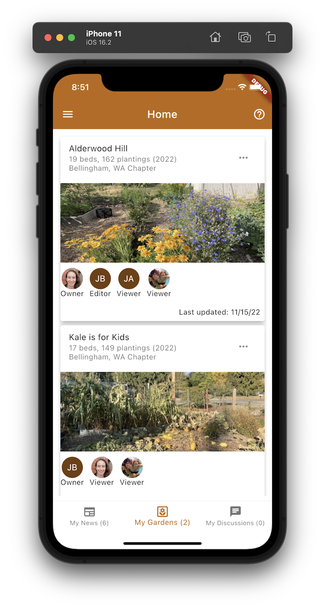

# flutter_agc_mockup

This repository contains the first increment of work on a mockup of the Agile Garden Club application. It contains around a dozen pages along with simple navigation. 

## Splash, signin, and signup pages:

  
&nbsp; &nbsp; 
  
&nbsp; &nbsp; 
  

## Home page: My News, My Gardens, My Discussions

  
&nbsp; &nbsp; 
  
&nbsp; &nbsp; 
  

## Navigation Drawer, Gardens, and Chapters pages

  
&nbsp; &nbsp; 
  
&nbsp; &nbsp; 
  

## Outcomes, Seeds, Members pages

  
&nbsp; &nbsp; 
  
&nbsp; &nbsp; 
  

## Discussions page

  

